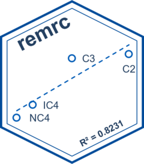

<!-- README.md is generated from README.Rmd. Please edit that file -->

# remrc 

<!-- badges: start -->
<!-- badges: end -->

Calculation of the component composition of model gas for physical
recombination of a saturated fluid. Solution of the problem of reverse
mathematical recombination by the Newton-Raphson method.
